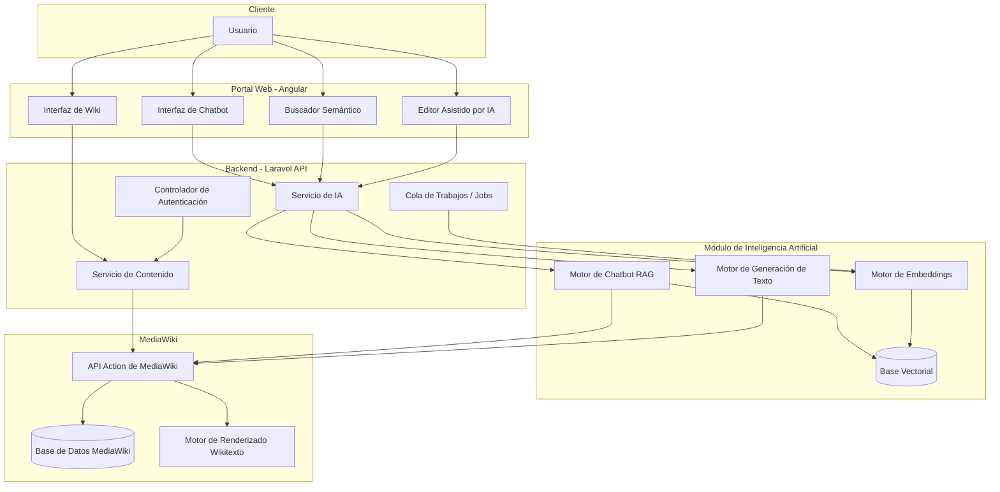
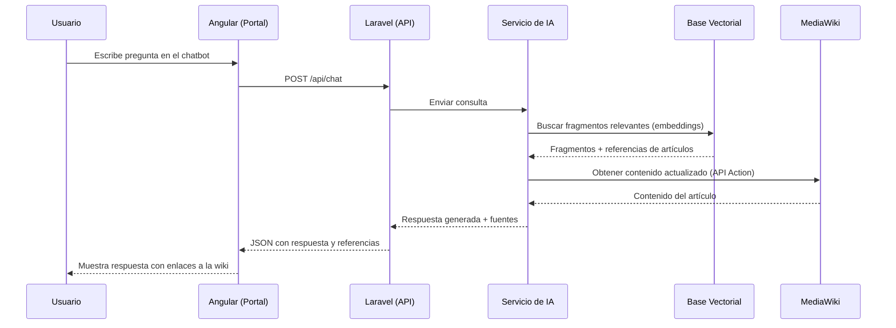
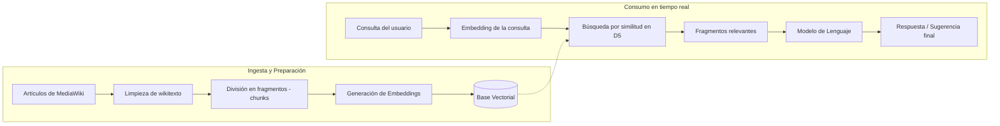
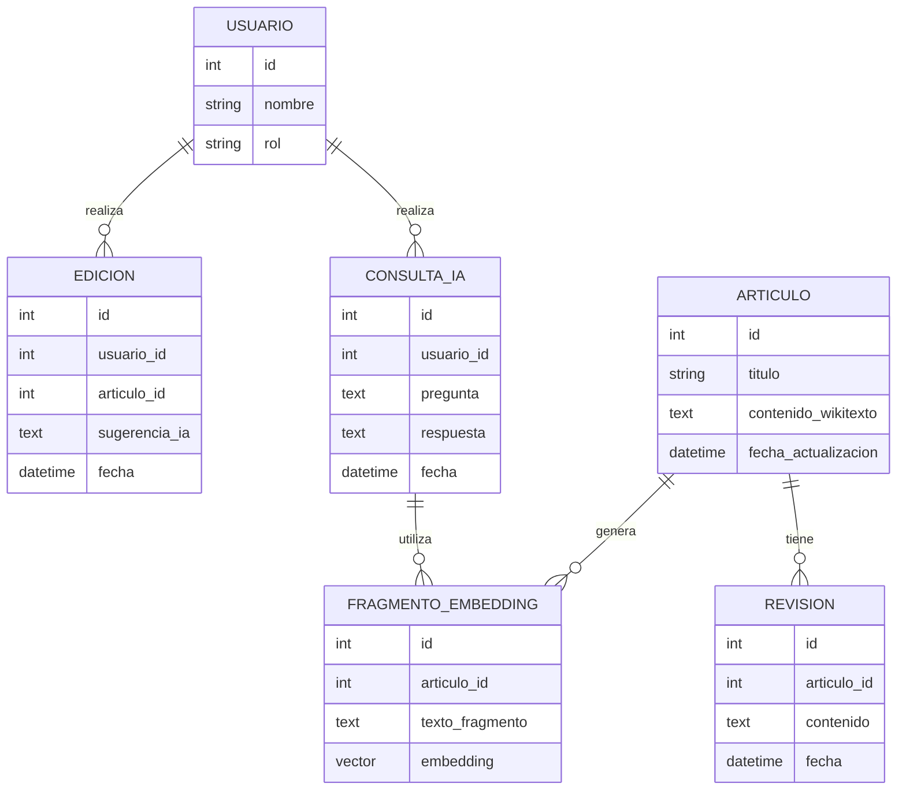

# Portal Wiki Inteligente — MediaWiki + IA

> Trabajo de investigación: extensión y modernización de MediaWiki mediante un portal web propio (Angular + Laravel) e integración de módulos de Inteligencia Artificial (chatbot conversacional, búsqueda semántica y generación/asistencia de contenido).

---

## Tabla de contenidos

1. [Descripción general](#descripción-general)
2. [Objetivos del proyecto](#objetivos-del-proyecto)
3. [Arquitectura del sistema](#arquitectura-del-sistema)
4. [Componentes principales](#componentes-principales)
5. [Flujo de datos](#flujo-de-datos)
6. [Integración de Inteligencia Artificial](#integración-de-inteligencia-artificial)
7. [Modelo de datos](#modelo-de-datos)
8. [Stack tecnológico](#stack-tecnológico)
9. [Estructura del repositorio](#estructura-del-repositorio)
10. [Endpoints principales de la API](#endpoints-principales-de-la-api)
11. [Instalación y configuración](#instalación-y-configuración)
12. [Roadmap](#roadmap)
13. [Licencia](#licencia)

---

## Descripción general

Este proyecto toma **MediaWiki** (el motor de software libre que utiliza Wikipedia) como núcleo de gestión de contenido colaborativo, y lo extiende con:

- Un **portal web independiente** construido en **Angular** (frontend) y **Laravel** (backend/API), que actúa como capa de presentación y orquestación sobre MediaWiki.
- Un **módulo de Inteligencia Artificial** compuesto por tres capacidades:
  1. **Chatbot conversacional** que responde preguntas usando el contenido de la wiki como base de conocimiento.
  2. **Buscador semántico**, que mejora la búsqueda tradicional por palabras clave con búsqueda por significado (embeddings).
  3. **Asistente de generación de contenido**, que ayuda a redactar, resumir o sugerir mejoras en artículos.

MediaWiki no se modifica en su núcleo (core): se conserva su integridad y capacidad de actualización, y toda la lógica nueva vive en Laravel, que se comunica con MediaWiki a través de su **API Action** y su base de datos.

---

## Objetivos del proyecto

- **Objetivo general:** Diseñar e implementar una arquitectura extendida sobre MediaWiki que permita ofrecer una experiencia de portal moderno, con capacidades de IA integradas, sin comprometer la estabilidad del motor wiki original.

- **Objetivos específicos:**
  - Documentar la arquitectura de MediaWiki y su capacidad de extensión (hooks, API, extensiones).
  - Diseñar un portal web desacoplado (Angular) que consuma datos de MediaWiki a través de un backend intermedio (Laravel).
  - Implementar un chatbot basado en Recuperación Aumentada por Generación (RAG) sobre el contenido de la wiki.
  - Implementar búsqueda semántica mediante embeddings vectoriales.
  - Implementar un asistente de redacción/generación de contenido apoyado en un modelo de lenguaje.
  - Evaluar el desempeño, la precisión y la experiencia de usuario del sistema resultante.

---

## Arquitectura del sistema



**Principios de diseño:**

- **Desacoplamiento:** MediaWiki permanece intacto; Laravel actúa como capa intermedia (backend for frontend).
- **Extensibilidad:** cualquier nuevo modelo de IA se puede añadir como un nuevo servicio en el módulo de IA sin tocar Angular ni MediaWiki.
- **Trazabilidad:** todas las respuestas generadas por IA referencian el artículo de origen de la wiki.

---

## Componentes principales

### 1. MediaWiki (núcleo de contenido)
- Gestiona artículos, historial de revisiones, categorías y permisos.
- Expone contenido mediante su **API Action** (`api.php`) en formato JSON.
- Fuente única de verdad del conocimiento del sistema.

### 2. Backend — Laravel
- Expone una API REST propia consumida por Angular.
- Orquesta las llamadas entre el portal, MediaWiki y los servicios de IA.
- Maneja autenticación, autorización y control de acceso.
- Ejecuta tareas asíncronas (indexado de embeddings, generación de resúmenes) mediante colas (queues).

### 3. Frontend — Angular
- Portal de usuario final: navegación de artículos, panel de búsqueda, chat y editor asistido.
- Consume exclusivamente la API de Laravel (nunca llama a MediaWiki directamente).

### 4. Módulo de IA
- **Chatbot (RAG):** recupera fragmentos relevantes de artículos (vía base vectorial) y los usa como contexto para generar una respuesta.
- **Buscador semántico:** convierte la consulta del usuario en un vector y la compara contra los embeddings de los artículos.
- **Asistente de generación:** sugiere redacción, resúmenes o correcciones de estilo sobre el wikitexto.

---

## Flujo de datos



---

## Integración de Inteligencia Artificial



| Capacidad de IA | Función | Entrada | Salida |
|---|---|---|---|
| Chatbot RAG | Responder preguntas con base en la wiki | Pregunta en lenguaje natural | Respuesta + artículos fuente |
| Búsqueda semántica | Encontrar artículos por significado, no solo por palabra clave | Texto de búsqueda | Lista de artículos relevantes ordenados por similitud |
| Asistente de generación | Ayudar a redactar/mejorar artículos | Borrador o instrucción del editor | Texto sugerido, resumen o corrección |

---

## Modelo de datos



---

## Stack tecnológico

| Capa | Tecnología |
|---|---|
| Motor Wiki | MediaWiki (PHP + MariaDB/MySQL) |
| Backend / API | Laravel (PHP) |
| Frontend | Angular |
| IA - Modelo de lenguaje | API de un LLM (ej. Anthropic Claude / OpenAI, configurable) |
| IA - Embeddings | Modelo de embeddings (ej. text-embedding, Sentence Transformers) |
| Base vectorial | pgvector / Milvus / Pinecone (a definir según infraestructura) |
| Autenticación | Laravel Sanctum / JWT |
| Contenedores | Docker / Docker Compose |
| Colas de trabajo | Laravel Queues (Redis) |

---

## Estructura del repositorio

```
proyecto-mediawiki-ia/
├── mediawiki/                # Instalación del motor MediaWiki
│   ├── extensions/
│   ├── skins/
│   └── LocalSettings.php
├── backend-laravel/          # API intermedia
│   ├── app/
│   │   ├── Http/Controllers/
│   │   ├── Services/
│   │   │   ├── ChatbotService.php
│   │   │   ├── SemanticSearchService.php
│   │   │   └── ContentAssistantService.php
│   │   └── Models/
│   ├── routes/api.php
│   └── config/
├── frontend-angular/         # Portal web
│   ├── src/app/
│   │   ├── wiki/
│   │   ├── chatbot/
│   │   ├── search/
│   │   └── editor-ia/
│   └── angular.json
├── docs/                     # Documentación de investigación
│   ├── diagramas/
│   └── metodologia.md
└── README.md
```

---

## Endpoints principales de la API

| Método | Endpoint | Descripción |
|---|---|---|
| `GET` | `/api/articulos` | Lista artículos disponibles desde MediaWiki |
| `GET` | `/api/articulos/{titulo}` | Obtiene el contenido de un artículo específico |
| `POST` | `/api/chat` | Envía una pregunta al chatbot y recibe respuesta con fuentes |
| `POST` | `/api/busqueda-semantica` | Realiza búsqueda semántica sobre el contenido de la wiki |
| `POST` | `/api/asistente/redaccion` | Solicita sugerencias de redacción o resumen para un artículo |
| `POST` | `/api/indexar` | Dispara el proceso de generación/actualización de embeddings |

---

## Instalación y configuración

### Requisitos previos
- PHP 8.1+
- Composer
- Node.js y npm/yarn (para Angular)
- MySQL/MariaDB
- Redis (para colas de Laravel)
- Docker (opcional, recomendado)

### Pasos generales

```bash
# 1. Clonar el repositorio
git clone <url-del-repositorio>
cd proyecto-mediawiki-ia

# 2. Instalar MediaWiki
# Seguir el instalador web de MediaWiki apuntando a la base de datos configurada

# 3. Backend Laravel
cd backend-laravel
composer install
cp .env.example .env
php artisan key:generate
php artisan migrate
php artisan queue:work

# 4. Frontend Angular
cd ../frontend-angular
npm install
ng serve
```

Configurar en `.env` de Laravel las credenciales de:
- Conexión a la base de datos de MediaWiki (solo lectura recomendada)
- API Key del modelo de lenguaje utilizado
- Conexión a la base vectorial

---

## Roadmap

- [ ] Documentar arquitectura base (este README)
- [ ] Levantar instancia local de MediaWiki
- [ ] Construir API Laravel de solo lectura sobre MediaWiki
- [ ] Implementar generación de embeddings de artículos existentes
- [ ] Implementar buscador semántico
- [ ] Implementar chatbot RAG
- [ ] Implementar asistente de redacción
- [ ] Construir portal Angular con las 3 vistas de IA
- [ ] Evaluación de resultados (precisión, relevancia, tiempos de respuesta)
- [ ] Redacción del informe final de investigación

---

## Licencia

MediaWiki se distribuye bajo licencia **GPL**. El código propio desarrollado en este proyecto (Laravel, Angular y módulos de IA) puede licenciarse según lo defina el equipo de investigación (se sugiere MIT para facilitar su uso académico).
